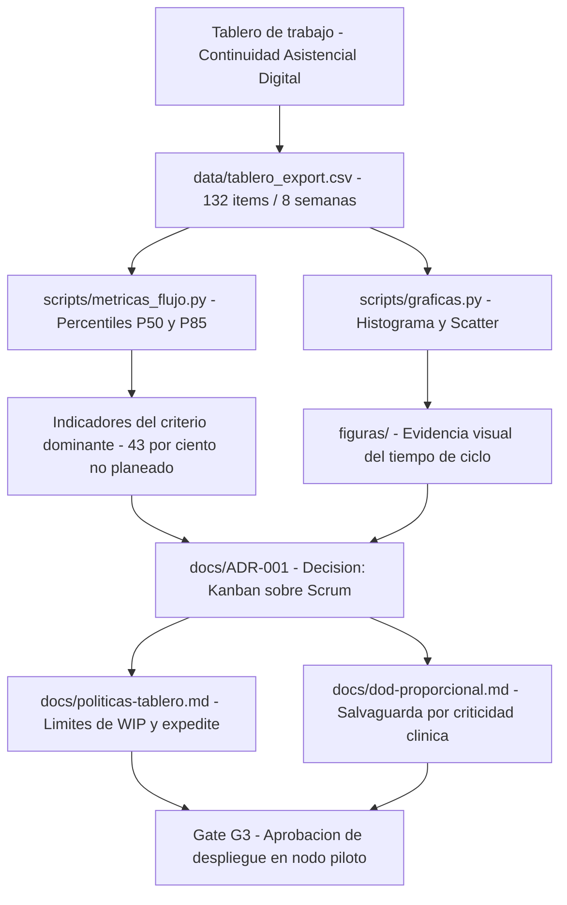
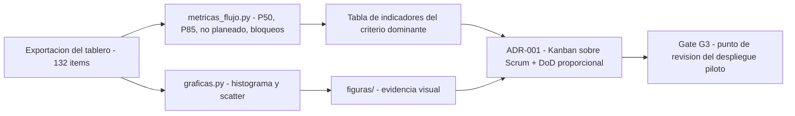

<div align="center">

# 📈 Evidencia de Flujo — Continuidad Asistencial Digital

### *Selección contextual de metodologías ágiles y evidencia mínima verificable*

**Módulo: Metodologías para el Desarrollo de Software · Unidad 3 — Actividad Formativa**

[]()
[]()
[]()
[]()
[-004488.svg)]()
[]()

**[Descripción](#-contexto-y-decisión) • [Contenido](#-contenido-del-repositorio) • [Herramientas](#-herramientas-utilizadas) • [Arquitectura](#️-arquitectura) • [Reproducir](#️-reproducir-los-indicadores) • [Indicadores](#-indicadores-que-sustentan-la-decisión) • [Autor](#-autor)**


</div>

---

## 📋 Tabla de Contenidos

- [🎯 Contexto y Decisión](#-contexto-y-decisión)
- [📁 Contenido del Repositorio](#-contenido-del-repositorio)
- [🧰 Herramientas Utilizadas](#-herramientas-utilizadas)
- [🏗️ Arquitectura](#️-arquitectura)
- [🔁 Flujo de la Evidencia](#-flujo-de-la-evidencia)
- [📊 Indicadores que Sustentan la Decisión](#-indicadores-que-sustentan-la-decisión)
- [🧱 Requisitos Previos](#-requisitos-previos)
- [▶️ Reproducir los Indicadores](#️-reproducir-los-indicadores)
- [🧪 Verificación y Pruebas](#-verificación-y-pruebas)
- [🤝 Métrica en Pareja](#-métrica-en-pareja)
- [✨ Evidencias Incluidas](#-evidencias-incluidas)
- [📝 Nota](#-nota)
- [👥 Autor](#-autor)

---

## 🎯 Contexto y Decisión

Este repositorio contiene la **evidencia mínima verificable** que sustenta la decisión metodológica tomada para una plataforma de **continuidad asistencial digital** de una red pública de hospitales.

No contiene el producto de software, sino los artefactos que hacen **auditable** la elección del método: los datos del tablero, el cálculo de percentiles, las políticas operativas y el registro de la decisión. Cualquier revisor puede **reproducir los indicadores en menos de 15 minutos**.

> **Criterio dominante:** variabilidad de llegada de la demanda.
> **Decisión:** Kanban sobre Scrum, conservando una Definición de Hecho proporcional.

### 🌟 ¿Por qué esta evidencia es relevante?

- 🎯 **Dato de origen verificable**: todo indicador se rastrea hasta un campo de `tablero_export.csv`.
- 🧮 **Cálculo reproducible**: los percentiles se obtienen ejecutando un script, no a mano.
- 📉 **Evidencia visual**: histograma y diagrama de dispersión del tiempo de ciclo.
- 🗂️ **Registro formal**: la decisión queda en un ADR con alternativa descartada y *trade-offs* aceptados.

---

## 📁 Contenido del Repositorio

### Estructura de nivel raíz

<table align="center">
  <tr><th>Elemento</th><th>Descripción</th></tr>
  <tr><td><code>evidencia-del-flujo-continuidad-asistencial/</code></td><td>📦 Evidencia mínima verificable: datos, scripts, figuras y documentos de decisión</td></tr>
  <tr><td><code>Post_Foro_U3.html</code></td><td>💬 Publicación del foro: cuadro comparativo, sustentación y referencias en APA 7</td></tr>
  <tr><td><code>qr_repo.png</code></td><td>🔳 Código QR de acceso directo a este repositorio</td></tr>
  <tr><td><code>README.md</code></td><td>📘 Este documento</td></tr>
  <tr><td><code>.gitignore</code></td><td>🚫 Mantiene en local los documentos editables (<code>.docx</code>, <code>.pdf</code>, <code>.xlsx</code>…) y el material de la actividad académica</td></tr>
</table>

### Dentro de `evidencia-del-flujo-continuidad-asistencial/`

| Ruta | Contenido |
|:---|:---|
| `data/tablero_export.csv` | Exportación del tablero: **132 ítems** en una ventana de **8 semanas** |
| `scripts/metricas_flujo.py` | Calcula percentiles **P50/P85**, proporción de trabajo no planeado y bloqueos |
| `scripts/graficas.py` | Genera el histograma y el diagrama de dispersión del tiempo de ciclo |
| `figuras/histograma_tiempo_ciclo.png` | Evidencia visual: distribución del tiempo de ciclo |
| `figuras/scatter_tiempo_ciclo.png` | Evidencia visual: dispersión del tiempo de ciclo |
| `figuras/qr_repositorio.png` | Código QR embebido en la evidencia |
| `docs/ADR-001-seleccion-kanban.md` | Registro formal de la decisión, alternativa descartada y consecuencias aceptadas |
| `docs/politicas-tablero.md` | Políticas de entrada/salida, límites de WIP y política de *expedite* |
| `docs/dod-proporcional.md` | Definición de Hecho graduada por nivel de riesgo clínico |
| `docs/bitacora-decisiones.md` | Cambios de política con su motivo y efecto medido |
| `README.md` | Copia de este documento para lectura de la carpeta de evidencia |
| `.gitignore` | Exclusiones de entorno Python (`__pycache__/`, `.venv/`, editores) |

> ℹ️ El repositorio versiona **solo la evidencia, el foro y el QR**. Los enunciados, la lectura fundamental y los documentos editables (`.docx`, `.pdf`, `.xlsx`…) quedan excluidos vía `.gitignore` y permanecen únicamente en local.

---

## 🧰 Herramientas Utilizadas

<div align="center">


</div>

| Componente | Uso |
|:---|:---|
| **Python 3** | Lenguaje de los scripts de métricas |
| **pandas** | Lectura del CSV y cálculo de percentiles P50/P85 |
| **matplotlib** | Generación del histograma y el diagrama de dispersión |
| **Markdown / ADR** | Registro de la decisión, políticas del tablero y bitácora |
| **Mermaid** | Diagramas de arquitectura y de flujo embebidos en la documentación |

---

## 🏗️ Arquitectura



---

## 🔁 Flujo de la Evidencia



---

## 📊 Indicadores que Sustentan la Decisión

| Indicador | Valor medido (8 semanas) | Fuente de verificación |
|:---|:---|:---|
| Trabajo no planeado | **43 %** de los ítems ingresados | `data/tablero_export.csv`, campo `planeado` |
| Variabilidad del tiempo de ciclo | **P50 = 4 d · P85 = 19 d** (cociente 4,7) | `scripts/metricas_flujo.py` |
| Ítems con bloqueo registrado | **33 de 132** | `data/tablero_export.csv`, campo `bloqueado_dias` |

> La cola larga no es aleatoria: se concentra en los ítems de tipo *Interoperabilidad* (**P85 = 52 días**), que dependen del motor **HL7/FHIR** externo. Ese hallazgo orienta dónde limitar el trabajo en curso.

---

## 🧱 Requisitos Previos

| Requisito | Versión |
|:---|:---|
| **Python** | 3.9 o superior |
| **Dependencias** | `pandas`, `matplotlib` (vía `pip`) |

---

## ▶️ Reproducir los Indicadores

1. Clonar el repositorio:
```bash
   git clone https://github.com/AlejoTechEngineer/evidencia-flujo-continuidad-asistencial.git
   cd evidencia-flujo-continuidad-asistencial/evidencia-del-flujo-continuidad-asistencial
```
2. Instalar dependencias:
```bash
   pip install pandas matplotlib
```
3. Calcular las métricas de flujo:
```bash
   python scripts/metricas_flujo.py data/tablero_export.csv
```
4. Regenerar las figuras:
```bash
   python scripts/graficas.py
```
5. Verificar que los percentiles obtenidos coincidan con la [tabla de indicadores](#-indicadores-que-sustentan-la-decisión).

---

## 🧪 Verificación y Pruebas

<details>
<summary><b>🔎 Ver escenarios de verificación cubiertos</b></summary>

| Escenario | Entrada | Resultado esperado |
|:---|:---|:---|
| Cálculo de percentiles | `metricas_flujo.py data/tablero_export.csv` | P50 = 4 d, P85 = 19 d |
| Proporción de trabajo no planeado | Campo `planeado` del CSV | 43 % de los ítems |
| Conteo de bloqueos | Campo `bloqueado_dias` del CSV | 33 de 132 ítems |
| Cola larga por tipo | Filtro por *Interoperabilidad* | P85 = 52 d (dependencia HL7/FHIR) |
| Evidencia visual | `graficas.py` | `figuras/histograma_tiempo_ciclo.png` y `figuras/scatter_tiempo_ciclo.png` regenerados |

</details>

---

## 🤝 Métrica en Pareja

| Dimensión | Métrica | Lectura esperada en 2–3 semanas |
|:---|:---|:---|
| Flujo / valor | Tiempo de ciclo **P85** por tipo de ítem | Descenso de 19 a ≤ 14 días |
| Calidad / defecto | Densidad de defectos **P1/P2** posliberación | Estable o a la baja frente a línea base |
| Control | Cumplimiento de **WIP** | ≥ 80 % en ventana de cuatro semanas |

> **Regla de lectura acoplada:** si el P85 baja pero el cumplimiento de WIP cae por debajo del 80 %, la mejora no es sostenible y se está trasladando el problema, no resolviéndolo.

---

## ✨ Evidencias Incluidas

Cada decisión metodológica cuenta con:

- 📁 **Dato de origen** verificable en la exportación del tablero.
- 🧮 **Cálculo reproducible** mediante script ejecutable.
- 📉 **Evidencia visual** en histograma y diagrama de dispersión.
- 🗂️ **Registro de la decisión** en formato ADR, con alternativa descartada y *trade-offs* aceptados.
- 🚦 **Punto de revisión** explícito en la gate G3.

---

## 📝 Nota

Los datos corresponden a un **caso de estudio académico**. No representan a una institución real ni contienen información de pacientes.

---

## 👥 Autor

<div align="center">

Trabajo desarrollado en el marco de la asignatura **Metodologías para el Desarrollo de Software**
(Maestría en Arquitectura de Software).

| Autor | Perfil |
|:---:|:---:|
| **Alejandro De Mendoza** | [](https://github.com/AlejoTechEngineer) |

</div>

---

<div align="center">

### 📈 *El método no se elige por preferencia: se elige por la variabilidad que muestran los datos*

**Unidad 3 · Actividad Formativa · Evidencia de Flujo**

</div>
