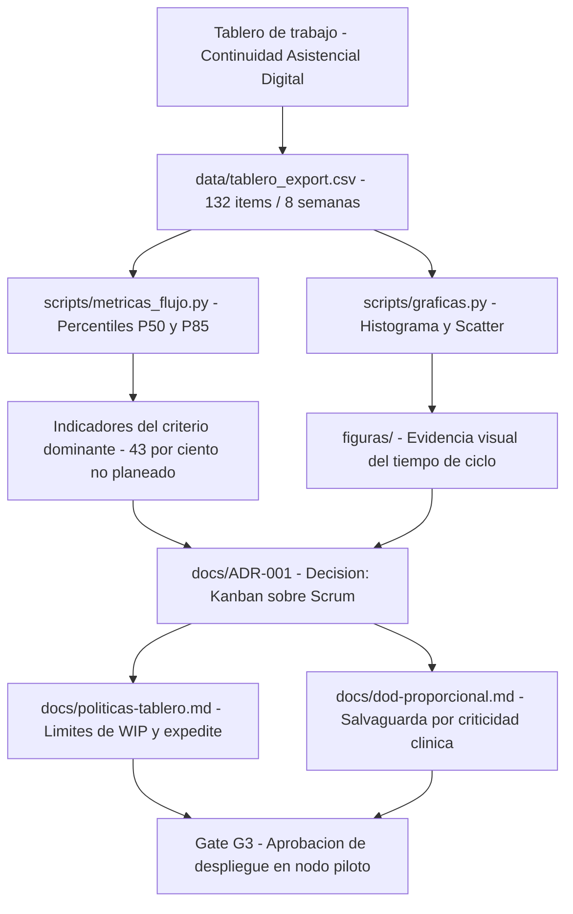

<div align="center">

# Evidencia de Flujo — Continuidad Asistencial Digital

### Selección contextual de metodologías ágiles y evidencia mínima verificable

**Unidad 3 · Metodologías para el Desarrollo de Software · Maestría en Arquitectura de Software**

</div>

---

Este repositorio contiene la **evidencia mínima verificable** que sustenta la decisión metodológica
tomada para una plataforma de continuidad asistencial digital de una red pública de hospitales.

No contiene el producto de software, sino los artefactos que hacen **auditable** la elección del
método: los datos del tablero, el cálculo de percentiles, las políticas operativas y el registro
de la decisión. Cualquier revisor puede reproducir los indicadores en menos de 15 minutos.

> **Criterio dominante:** variabilidad de llegada de la demanda.
> **Decisión:** Kanban sobre Scrum, conservando una Definición de Hecho proporcional.

## Contenido del repositorio:

- `Post_Foro_U3.html` → Publicación del foro con el cuadro comparativo, la sustentación y las referencias en APA 7.
- `qr_repo.png` → Código QR de acceso directo a este repositorio.
- `data/tablero_export.csv` → Exportación del tablero: 132 ítems en una ventana de 8 semanas.
- `scripts/metricas_flujo.py` → Calcula percentiles P50/P85, proporción de trabajo no planeado y bloqueos.
- `scripts/graficas.py` → Genera el histograma y el diagrama de dispersión del tiempo de ciclo.
- `docs/ADR-001-seleccion-kanban.md` → Registro formal de la decisión, alternativa descartada y consecuencias aceptadas.
- `docs/politicas-tablero.md` → Políticas de entrada/salida, límites de WIP y política de expedite.
- `docs/dod-proporcional.md` → Definición de Hecho graduada por nivel de riesgo clínico.
- `docs/bitacora-decisiones.md` → Cambios de política con su motivo y efecto medido.

## Arquitectura



## Indicadores que sustentan la decisión

| Indicador | Valor medido (8 semanas) | Fuente de verificación |
|---|---|---|
| Trabajo no planeado | 43 % de los ítems ingresados | `data/tablero_export.csv`, campo `planeado` |
| Variabilidad del tiempo de ciclo | P50 = 4 d, P85 = 19 d (cociente 4,7) | `scripts/metricas_flujo.py` |
| Ítems con bloqueo registrado | 33 de 132 | `data/tablero_export.csv`, campo `bloqueado_dias` |

La cola larga no es aleatoria: se concentra en los ítems de tipo *Interoperabilidad* (P85 = 52 días),
que dependen del motor HL7/FHIR externo. Ese hallazgo orienta dónde limitar el trabajo en curso.

## Reproducir los indicadores:

1. Clonar el repositorio:
```bash
   git clone https://github.com/AlejoTechEngineer/evidencia-flujo-continuidad-asistencial.git
   cd evidencia-flujo-continuidad-asistencial
```
2. Instalar dependencias:
```bash
   pip install pandas matplotlib
```
3. Calcular las métricas de flujo:
```bash
   python scripts/metricas_flujo.py data/tablero_export.csv
```
4. Regenerar las figuras:
```bash
   python scripts/graficas.py
```
5. Verificar que los percentiles obtenidos coincidan con la tabla de indicadores.

## Métrica en pareja

| Dimensión | Métrica | Lectura esperada en 2–3 semanas |
|---|---|---|
| Flujo / valor | Tiempo de ciclo **P85** por tipo de ítem | Descenso de 19 a ≤ 14 días |
| Calidad / defecto | Densidad de defectos **P1/P2** posliberación | Estable o a la baja frente a línea base |
| Control | Cumplimiento de **WIP** | ≥ 80 % en ventana de cuatro semanas |

> **Regla de lectura acoplada:** si el P85 baja pero el cumplimiento de WIP cae por debajo del 80 %,
> la mejora no es sostenible y se está trasladando el problema, no resolviéndolo.

## Evidencias incluidas

Cada decisión metodológica cuenta con:

- **Dato de origen** verificable en la exportación del tablero.
- **Cálculo reproducible** mediante script ejecutable.
- **Evidencia visual** en histograma y diagrama de dispersión.
- **Registro de la decisión** en formato ADR, con alternativa descartada y trade-offs aceptados.
- **Punto de revisión** explícito en la gate G3.

## Nota

Los datos corresponden a un caso de estudio académico. No representan a una institución real ni
contienen información de pacientes.

## Autor:

Este trabajo fue desarrollado en el marco de la asignatura **Metodologías para el Desarrollo de Software**.

- ***Alejandro De Mendoza*** – [Perfil GitHub](https://github.com/AlejoTechEngineer)

---
